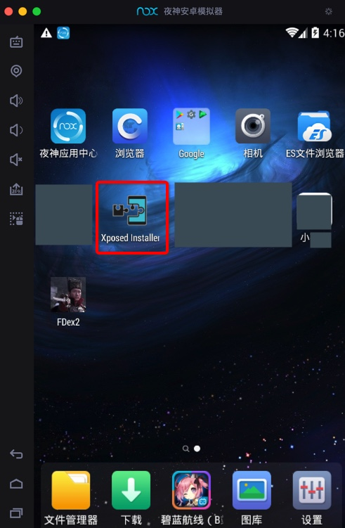

# Xposed

* `Xposed`
  * 典型用途
    * 用于安装相关插件比如`FDex2`，配合安卓破解，导出运行时`app`的`dex`文件
    * 基于`XPosed`编写hook插件，实现特定功能
  * 使用举例
    * 安装到`夜神模拟器`中的`XPosed`
      * 
  * 最新为：`EdXposed`
  * 详见
    * 独立教程：[强大的安卓破解辅助工具：XPosed框架](https://book.crifan.org/books/crack_assistant_xposed_framework/website/)
