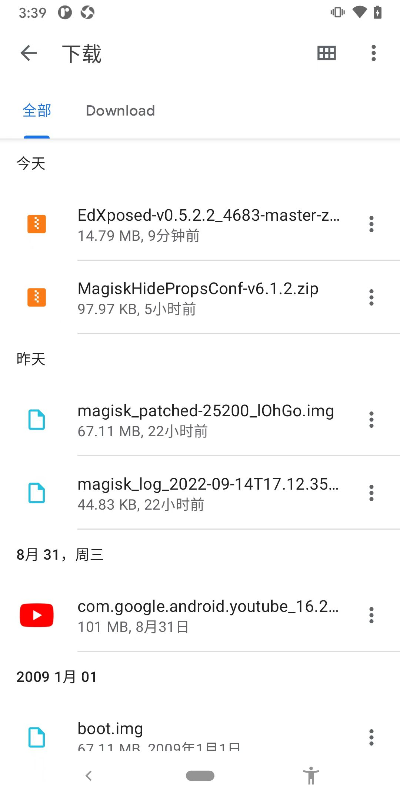

# 文件管理

安卓逆向期间，常涉及到文件管理方面的内容。

## 文件上传和下载=导入导出文件

* 用文件管理器
* 用命令：adb
  * 导出文件
    ```bash
    adb pull /mnt/sdcard/Download/com.lanyou.bydwj.ikk/ .
    ```
  * 导入文件
    ```bash
    adb push boot.img /sdcard/Download/boot.img

    adb push riru-v25.4.4-debug.zip /sdcard/Download
    ```

## 文件目录的关系

常见目录：

* `/sdcard`：SD卡根目录，即普通用户保存文件的根目录
  * `/sdcard/Download`：下载目录
    * 安卓手机中，通过`浏览器`等工具下载的文件，往往默认保存在到`下载`目录，就是这个：`/sdcard/Download`

对应的查看效果：

* 文件管理器
  * 文件极客
    * 
* 命令行
  * adb shell
    ```bash
    crifan@licrifandeMacBook-Pro  ~/dev/dev_tool/android/EdXposed  adb shell
    blueline:/ $ whoami
    shell
    blueline:/ $ cd /sdcard/Download
    blueline:/sdcard/Download $ ls -lh
    total 120M
    -rw-rw---- 1 root everybody 14M 2022-09-15 15:30 EdXposed-v0.5.2.2_4683-master-z-debug.zip
    -rw-rw---- 1 root everybody 96K 2022-09-15 10:02 MagiskHidePropsConf-v6.1.2.zip
    -rw-rw---- 1 root everybody 64M 2009-01-01 00:00 boot.img
    -rw-rw---- 1 root everybody 97M 2022-08-31 11:16 com.google.android.youtube_16.29.36.apk
    -rw-rw---- 1 root everybody 44K 2022-09-14 17:12 magisk_log_2022-09-14T17.12.35.log
    -rw-rw---- 1 root everybody 64M 2022-09-14 17:18 magisk_patched-25200_lOhGo.img
    ```
