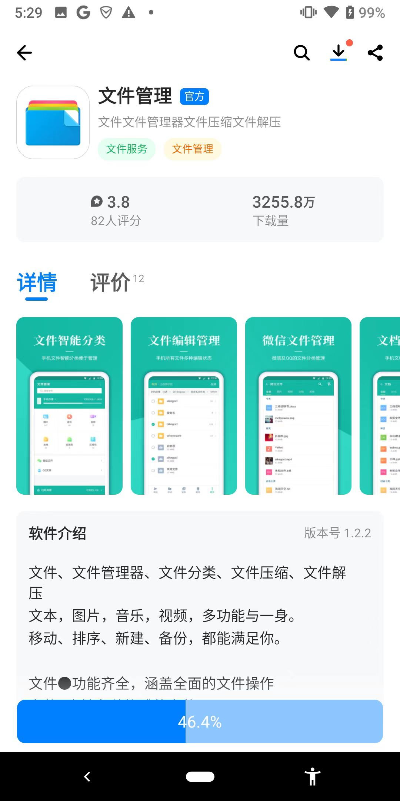
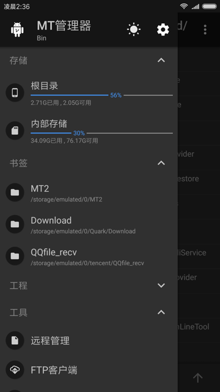
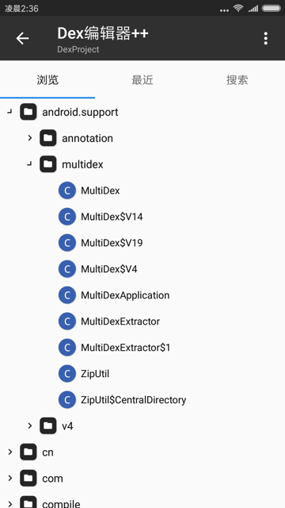

# 文件管理器

TODO：

* 【已解决】安卓中把微信传输收到的apk.1改名为apk去掉.1的后缀
* 【已解决】安卓手机Google Pixel3用文件管理管理文件
* 【已解决】安卓手机Google Pixel3中用ES文件管理器安装youtube的apk
* 【已解决】安卓手机中安装YouTube的apk报错：应用未安装
* 【已解决】安卓手机中打开log日志文件查看内容
* 【部分解决】安卓手机Google Pixel3中用RE文件管理器拷贝和移动文件夹
* 【已解决】导出安卓手机Google Pixel3中的文件
* 【未解决】安卓手机Google Pixel3中用ES文件管理器拷贝和移动文件夹
* 

---

* Android的文件管理器
  * 推荐：`文件管理`
    * 应用宝中搜`文件管理`，而找到的
      * 
  * 其他可选
    * `ES文件管理器`
    * `RE`
    * `MT管理器`
    * 安卓模拟器中的文件管理器
      * 夜神模拟器中自带文件浏览器
* 常见的用途
  * 给文件改名
    * `xxx.apk.1` -> `xxx.apk`
  * 查找文件
    * 再去安装apk文件
  * 查看文件内容
    * 查看log日志内容

## MT管理器

* `MT`=`MT管理器`=`MT Manager`=`MT Manager for Android`
* 是什么：安卓中的一个文件管理器
* 常被简称为：`MT2`
  * 因为最新版本是v2
    * 比如：
      * MT浏览器_V2.5.4.apk 文件管理器
      * 文件管理神器 MT Manager v2.6.1 for Android
      * MT管理器2.0

### 特点

* 支持在VirtualXposed中使用MT
* 除了普通文件管理功能外，还支持APK反编译相关功能

### 应用简介

MT管理器是一款强大的文件管理工具和APK逆向修改神器。

* 如果你喜欢它的双窗口操作风格，可以单纯地把它当成文件管理器使用。
* 如果你对修改APK有深厚的兴趣，那么你可以用它做许许多多的事
  * 例如汉化应用、替换资源、修改布局、修改逻辑代码、资源混淆、去除签名校验等，主要取决于你如何使用。

### 主要功能

* 文件复制、移动、创建软链接、重命名、删除、创建文件(夹)，文件批量操作。获取 Root 权限后可访问系统目录，挂载文件系统为读写，修改文件权限和所有者。
* 像 WinRAR 那样打开 ZIP 格式文件，可以对 ZIP 内的文件进行删除、重命名、移动，添加/替换外部文件到 ZIP 中，无需解压后再重新打包，同时支持单独解压 ZIP 内的部分文件。
* 自带强大的文本编辑器，可以流畅编辑大文本文件，支持设置是否显示行号、开关自动换行、双指缩放字体大小、自动识别编码、代码语法高亮、自动缩进、正则搜索替换。
* 拥有图片查看、音乐播放、字体预览、执行脚本、文本对比等功能，在侧拉栏中可方便地查看存储设备、FTP连接、书签、后台、工具等。
* APK 编辑功能，主要有 DEX 编辑，ARSC 编辑，XML 编辑，APK 签名、APK 优化、APK 共存、去除签名校验、RES 资源混淆、RES 反资源混淆、翻译模式等。

### 截图举例

