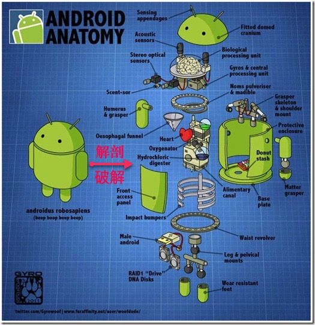

# Android逆向开发概览

此处介绍[安卓的安全和逆向](https://book.crifan.org/books/android_app_security_crack/website/)中的`安卓逆向`中关于`安卓逆向开发`相关的内容：

* 背景
  * 安卓应用的`存在形式`
    * 静态的
      * 安装文件：`apk`
    * 动态的
      * 运行中的程序叫：`app`
* 安卓逆向开发 = 安卓破解
  * `安卓破解`=`android crack`
    * 破解
      * =`crack`=`cracking`
      * 也叫`安卓逆向工程`=`安卓反向工程`
        * 而逆向工程，就像对一个人去解剖
          * 
  * 概述
    * 核心流程
      * 安卓root
      * 安装apk
      * 搞懂逻辑
        * 静态分析
        * 动态调试
      * 输出结果
        * 重新打包apk
    * 详见
      * [Android逆向典型流程](../typical_process/README.md)
