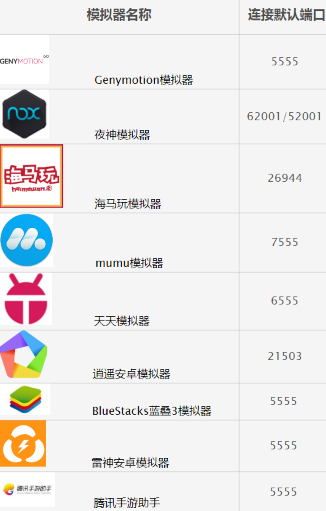

# 相关资料

* DDMS
  * [Using Dalvik Debug Monitor Service (DDMS) | Android Developers (sourceforge.net)](http://wing-linux.sourceforge.net/guide/developing/tools/ddms.html)
  * [Using DDMS | Android Developers (android-doc.github.io)](https://android-doc.github.io/tools/debugging/ddms.html#how-ddms-works)
* 常见安卓模拟器的调试端口
  * 
* https://developer.android.com
  * 安卓 调试 debug
    * [调试应用  |  Android 开发者  |  Android Developers](https://developer.android.com/studio/debug)
  * Android Device Monitor
    * [Android Device Monitor  |  Android 开发者  |  Android Developers](https://developer.android.com/studio/profile/monitor.html)
